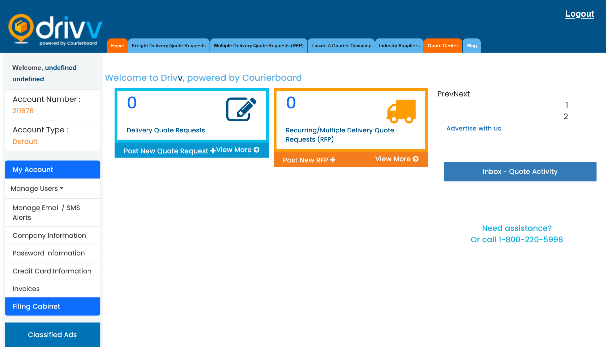
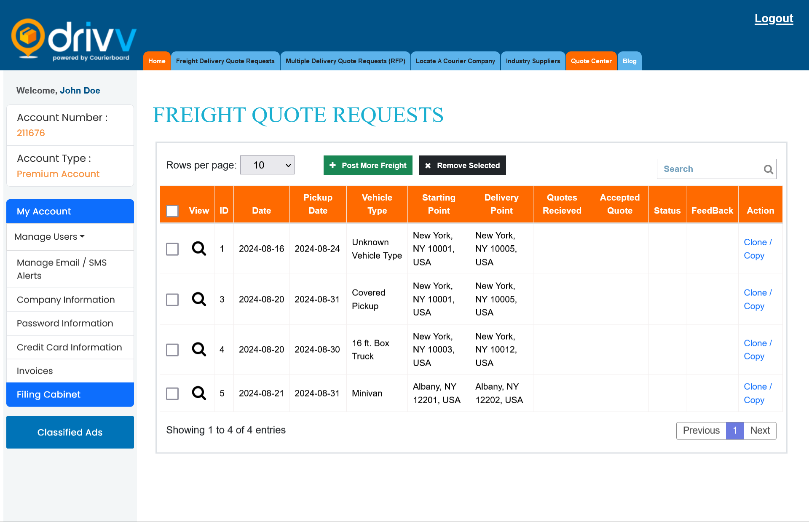
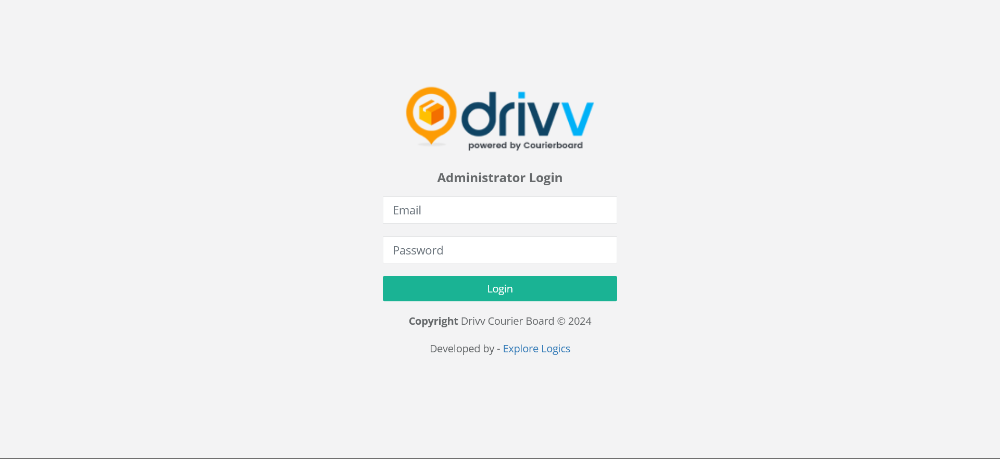
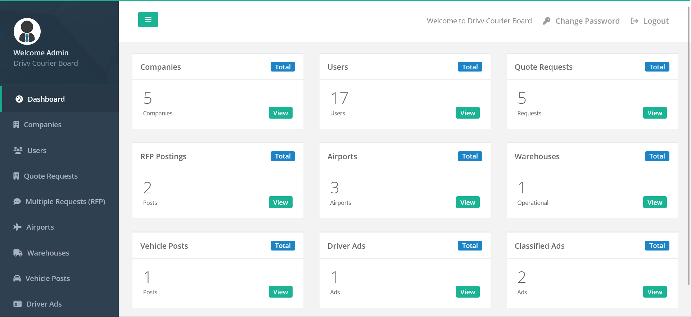
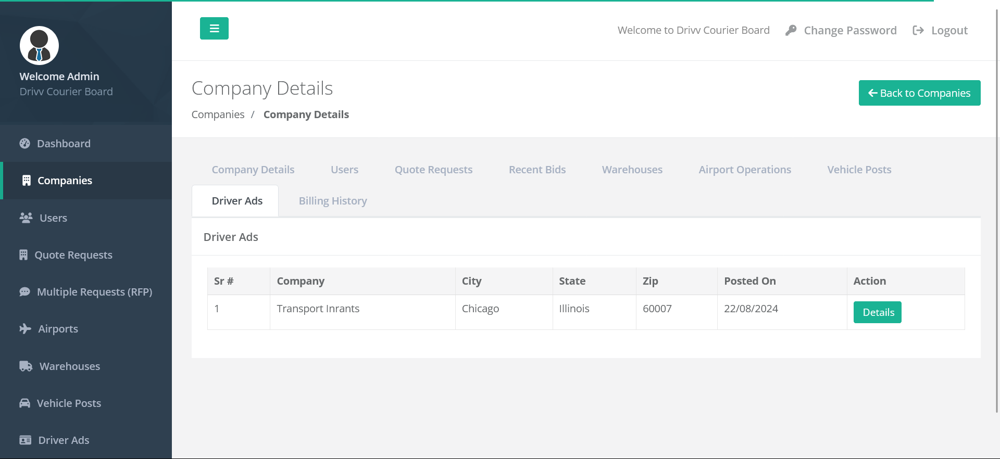

# Drriv Courier Board: Your Laravel Based Comprehensive Delivery Network Solution

Drriv Courier Board is a powerful online delivery network system built with Laravel. It connects shippers, courier companies, 3PLs, freight forwarders, and other stakeholders across the United States and Canada, streamlining the entire shipping process.

With over 4,500 member companies, Drriv Courier Board fosters efficient client hunting and shipping company searching, bringing all parties together on a single platform.


**Key Features:**

* **Efficient Communication:** Seamlessly request quotes, bid on existing requests, and collaborate with other users on the platform.
* **Team Management:** Create internal teams, add users, and manage projects within a secure, centralized filing cabinet.
* **Clear Visibility:** Companies can add their key locations (airports, warehouses) for easy identification and selection by shippers.
* **Comprehensive Services:** From managing recurring freight shipments to advertising goods and services through classifieds, Drriv Courier Board offers a one-stop solution for all your delivery needs.

**Technologies:**

* **Front-end:** HTML, CSS, Bootstrap, JavaScript, React JS
* **Back-end:** PHP, Laravel Framework, MySQL
* **Development Tools:** XAMPP server, VS Code IDE, Postman (REST API documentation) 

## Getting Started

### Clone the Repository

Clone the repository using the following command:

```bash
git clone https://github.com/arslanstack/drriv.git
```
### Installation

After cloning the project, navigate into the project directory and install dependencies:

```bash
cd drriv
composer install
```

### Configuration

1. Copy the example .env file:

```bash
cp .env.example .env
```

2. Generate the application key:

```bash
php artisan key:generate
```

3. Update the .env file:
Open the .env file in a text editor and update the necessary configuration values, such as database connection details. Example:

```bash
DB_CONNECTION=mysql
DB_HOST=127.0.0.1
DB_PORT=3306
DB_DATABASE=courierboard
DB_USERNAME=root
DB_PASSWORD=
```

### Database Setup

1. Create a new MySQL database:
Create new database using phpmyadmin or mysql workbench


2. Run the migrations:

```bash
php artisan migrate
```
### Running the Application

Start the Laravel server and compile assets:

```bash
php artisan serve
```

### Contributing

After implementing a feature or fix, use the following commands to commit and push your changes:

```bash
git add .
git commit -m "Describe the feature"
git push -u origin
```

### Snapshots







